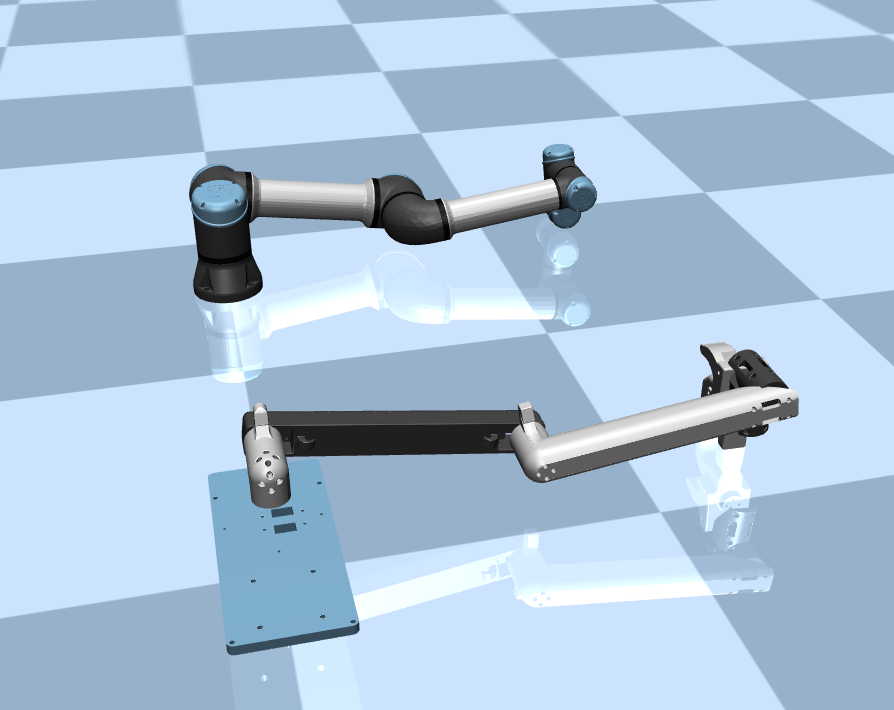

# Gello_sim
This project is aiming at load gello model into MuJoCo and connect it with certain robot arm. [GELLO](https://wuphilipp.github.io/gello_site/) is a general framework for building low-cost and intuitive teleoperation systems for robotic manipulation. For further information, you can find it here: [Software](https://github.com/wuphilipp/gello_software) and [Hardware](https://github.com/wuphilipp/gello_mechanical). 


# Content
* `UR5`: contains STL meshes and XML file that needed to run the the [UR5 arm model](https://github.com/google-deepmind/mujoco_menagerie/tree/main/universal_robots_ur5e) and its gello model
    * `UR5/ur5`: contains meshes and XML file for the general UR5 arm
    * `UR5/gello_ur5`: contains meshes and XML file for the gello ur5 
    * `UR5/ur5_scene.xml`: An overall XML file that contain both the robot arm and its xml file

* `AgileX_Piper`: contains STL meshes and XML file that needed to run the the AgileX Piper arm model and its gello model (Have not uplaoded yet)
    * `AgileX_Piper/mesher`: contains all the meshes of AgileX Piper(including original urdf discription) and AgileX Piper gello 
    * `AgileX_Piper/agilex_piper.xml`: xml discription of original aiglex piper arm
    * `AgileX_Piper/agilex_piper.xml`: xml discription of gello aiglex piper arm
    * `AgileX_Piper/piper_scene.xml`:` An overall XML file that contain both the robot arm 
* `main.py`: The main script to run the simulation


# Preparation
Currently we have two models: UR5 arm and AgileX Piper arm. The original UR5 arm model can be found [here](https://github.com/google-deepmind/mujoco_menagerie/tree/main/universal_robots_ur5e), and the gello UR5 arm model it only provided with the stl meshes which can be found [here](https://github.com/wuphilipp/gello_mechanical/tree/main/ur5). As for the AgilX Piper arm, the we can only find the urdf discription from [here](https://github.com/agilexrobotics/Piper_ros). After that follow the [instruction](https://github.com/robotlearning123/dual_ur5_husky_mujoco?tab=readme-ov-file), we can easily get the xml file. 


# Requirements:
* `python==3.10.12`
* `mujoco==3.1.6`

For the installation of MuJoCo, you can check this [page](https://gist.github.com/saratrajput/60b1310fe9d9df664f9983b38b50d5da#file-mujoco_py_install_instructions-md)


# Launch Simulation
* For UR5 model
<p align="center">
    
</p>


Run the following line interminal
```
    python main.py --model ur5 --info True ## To print out the joints info
```


* For AgileX Piper model 
<p align="center">
    
</p>

Run the following line interminal
```
    python main.py --model agilex_piper --info True  ## To print out the joints info
```


- Now you after you launch the simulatiuon, you can double click the end effector to select it and move it with right mouse while pressing ctrl!
- For more information you can press F1 or go to left UI `option`->`help`


